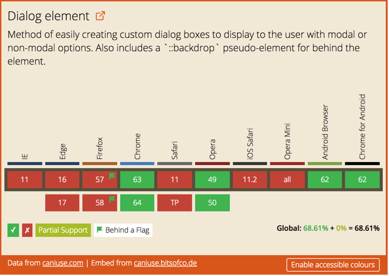

# [html 5.2](https://bitsofco.de/whats-new-in-html-5-2/)


## 1. 新功能

### 1.1 原生dialog元素

- 默认情况下，除非应用了open属性，否则该对话框将从视图（并从DOM访问）隐藏.

```html
<dialog open>
    <h2>Dialog Title</h2>
    <p>Dialog content and other stuff will go here</p>
</dialog>
```

- open属性可以通过调用show（）和close（）方法来切换，任何HTMLDialogElement都可以使用这个方法。

```html
<button id="open">Open Dialog</button>  
<button id="close">Close Dialog</button>

<dialog id="dialog">  
  <h2>Dialog Title</h2>
  <p>Dialog content and other stuff will go here</p>
</dialog>

<script>  
const dialog = document.getElementById("dialog");

document.getElementById("open").addEventListener("click", () => {  
  dialog.show();
});

document.getElementById("close").addEventListener("click", () => {  
  dialog.close();
});
</script>  
```

> 浏览器兼容性：Chrome浏览器中已经有了<dialog>元素的支持，并且在Firefox中有一个标志




### 1.2 iFrames中可以使用支付请求API（Payment Request API)


- 添加了allowpaymentrequest属性以允许iframe控制支付请求API的访问。这也意味着嵌入了第三方内容的页面能够控制该第三方内容是否可向用户请求获取支付凭证，进而让可嵌入的购物车工具可以利用新的API.

```html
<iframe allowpaymentrequest>  
```

### 1.3 size 属性支持Apple Icons

- 要定义网页图标，我们使用文档头部的<link rel =“icon”>元素。要定义不同大小的图标，我们使用sizes属性。

```html
<link rel="icon" sizes="16x16" href="path/to/icon16.png">  
<link rel="icon" sizes="32x32" href="path/to/icon32.png">  
```

## 2. 最新的有效实践

### 2.1 多个<main>元素

- 我们可以使用多个<main>元素，如果只想一个是可见的，其余的用hidden属性隐藏。

- <main>元素隐藏必须用hidden属性，其他的方法例如 display: none; 或者 visibility: hidden;都是无效的

```html
<main>111</main>
<main>222</main>
<main hidden>333</main>
```

### 2.2 可以在<body>里面用style

```html
<body>  
    <p>I’m cornflowerblue!</p>
    <style>
        p { color: cornflowerblue; }
    </style>
    <p>I’m cornflowerblue!</p>
</body>  
```

- 出于性能原因，最好将样式放置在<head>中。

- 如示例所示，样式不在作用域内。稍后在HTML文档中定义的内联样式仍然适用于之前定义的元素，这就是为什么它可能会触发重绘。


### 2.3 标题在一个 <legend>里面

- 在表单里，<legend>元素表示<fieldset>中的表单字段的标题。在HTML 5.2之前，图例的内容必须是纯文本。现在，我们可以包含标题元素。

```html
<fieldset>  
    <legend><h2>Basic Information</h2></legend>
    <!-- Form fields for basic information -->
</fieldset>  
<fieldset>  
    <legend><h2>Contact Information</h2></legend>
    <!-- Form fields for contact information -->
</fieldset>  
```

## 3. 删除的功能

- keygen：用于帮助生成表单的公钥

- menu and menuitem：用于创建导航或上下文菜单


