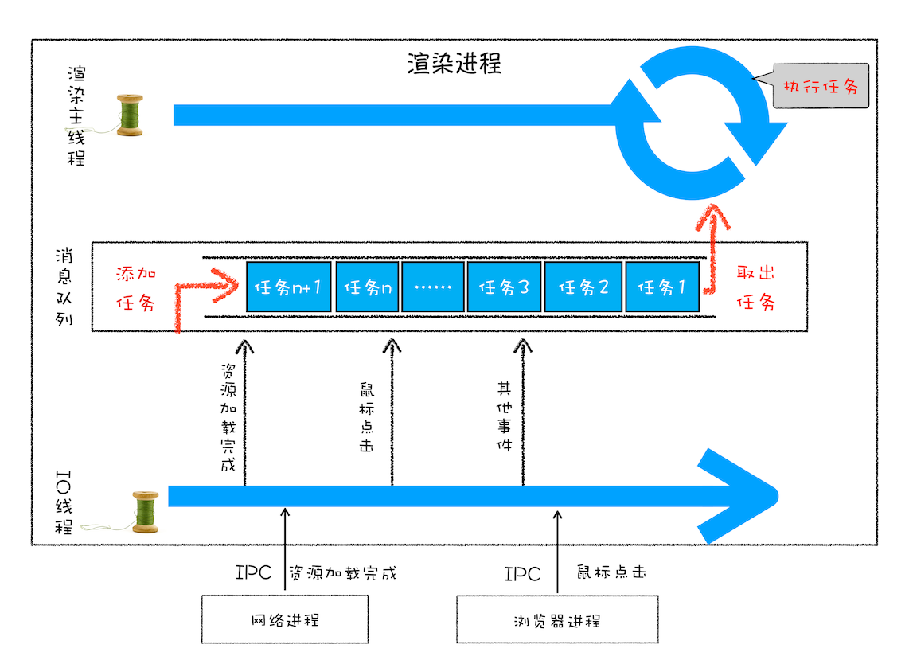

# chrome 消息队列和事件循环

最新的 Chrome 浏览器包括：1 个浏览器（Browser）主进程、1 个 GPU 进程、1 个网络（NetWork）进程、多个渲染进程和多个插件进程。

这几个进程的功能:  

1. 浏览器进程。主要负责界面显示、用户交互、子进程管理，同时提供存储等功能。
2. 渲染进程。核心任务是将 HTML、CSS 和 JavaScript 转换为用户可以与之交互的网页，排版引擎 Blink 和 JavaScript 引擎 V8 都是运行在该进程中，默认情况下，Chrome 会为每个 Tab 标签创建一个渲染进程。出于安全考虑，渲染进程都是运行在沙箱模式下。
3. GPU 进程。其实，Chrome 刚开始发布的时候是没有 GPU 进程的。而 GPU 的使用初衷是为了实现 3D CSS 的效果，只是随后网页、Chrome 的 UI 界面都选择采用 GPU 来绘制，这使得 GPU 成为浏览器普遍的需求。最后，Chrome 在其多进程架构上也引入了 GPU 进程。
4. 网络进程。主要负责页面的网络资源加载，之前是作为一个模块运行在浏览器进程里面的，直至最近才独立出来，成为一个单独的进程。
5. 插件进程。主要是负责插件的运行，因插件易崩溃，所以需要通过插件进程来隔离，以保证插件进程崩溃不会对浏览器和页面造成影响。

渲染进程内部的大多数任务都是在主线程上执行的，诸如 JavaScript 执行、DOM、CSS、计算布局、V8 的垃圾回收等任务。要让这些任务能够在主线程上有条不紊地运行，就需要引入消息队列。  

分为下面三个步骤：

- 添加一个消息队列；
- IO 线程中产生的新任务添加进消息队列尾部；
- 渲染主线程会循环地从消息队列头部中读取任务，执行任务。

页面线程所有执行的任务都来自于消息队列。消息队列是“先进先出”的属性，也就是说放入队列中的任务，需要等待前面的任务被执行完，才会被执行。

## 单消息队列的队头阻塞问题

渲染主线程会按照先进先出的顺序执行消息队列中的任务，具体地讲，当产生了新的任务，渲染进程会将其添加到消息队列尾部，在执行任务过程中，渲染进程会顺序地从消息队列头部取出任务并依次执行。在最初，采用这种方式没有太大的问题，因为页面中的任务还不算太多，渲染主线程也不是太繁忙。不过浏览器是向前不停进化的，其进化路线体现在架构的调整、功能的增加以及更加精细的优化策略等方面，这些变化让渲染进程所需要处理的任务变多了，对应的渲染进程的主线程也变得越拥挤。下图所展示的仅仅是部分运行在主线程上的任务

基于这种单消息队列的架构下，如果用户发出一个点击事件或者缩放页面的事件，而在此时，该任务前面可能还有很多不太重要的任务在排队等待着被执行，诸如 V8 的垃圾回收、DOM 定时器等任务，如果执行这些任务需要花费的时间过久的话，那么就会让用户产生卡顿的感觉

要解决上述问题，我们可以为不同类型的任务创建不同优先级的消息队列，比如：

- 可以创建输入事件的消息队列，用来存放输入事件。
- 可以创建合成任务的消息队列，用来存放合成事件。
- 可以创建默认消息队列，用来保存如资源加载的事件和定时器回调等事件。
- 还可以创建一个空闲消息队列，用来存放 V8 的垃圾自动垃圾回收这一类实时性不高的事件。  

在不同的场景下，根据实际情况，动态调整消息队列的优先级。

三个不同的场景，分别是加载过程，合成过程以及正常状态。  

不过依然存在一个问题，那就是在某个状态下，一直有新的高优先级的任务加入到队列中，这样就会导致其他低优先级的任务得不到执行，这称为任务饿死。Chromium 为了解决任务饿死的问题，给每个队列设置了执行权重，也就是如果连续执行了一定个数的高优先级的任务，那么中间会执行一次低优先级的任务，这样就缓解了任务饿死的情况。  
