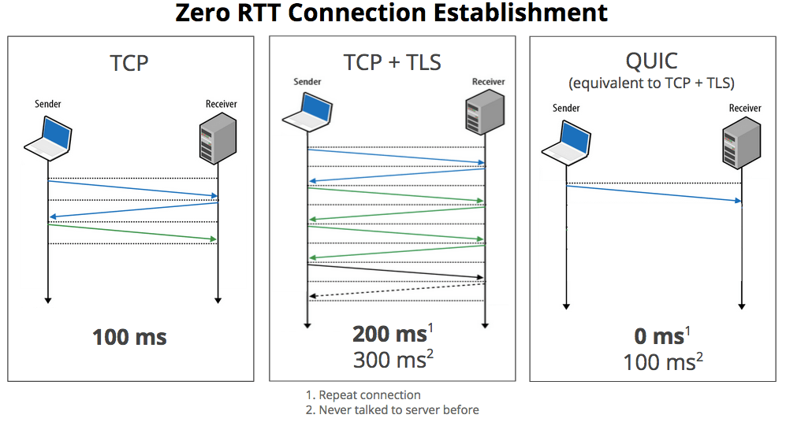
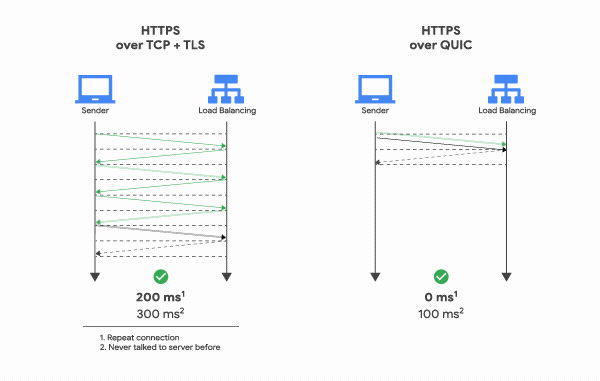

# HTTP/3

## http/3

HTTP/2 的一个核心特性是使用了多路复用技术，因此它可以通过一个 TCP 连接来发送多个 URL 请求。多路复用技术能充分利用带宽，最大限度规避了 TCP 的慢启动所带来的问题，同时还实现了头部压缩、服务器推送等功能，使得页面资源的传输速度得到了大幅提升。在 HTTP/1.1 时代，为了提升并行下载效率，浏览器为每个域名维护了 6 个 TCP 连接；而采用 HTTP/2 之后，浏览器只需要为每个域名维护 1 个 TCP 持久连接，同时还解决了 HTTP/1.1 队头阻塞的问题。  

虽然 HTTP/2 解决了应用层面的队头阻塞问题，不过和 HTTP/1.1 一样，HTTP/2 依然是基于 TCP 协议的，而 TCP 最初就是为了单连接而设计的。  

从一端发送给另外一端的数据会被拆分为一个个按照顺序排列的数据包，这些数据包通过网络传输到了接收端，接收端再按照顺序将这些数据包组合成原始数据，这样就完成了数据传输。  

不过，如果在数据传输的过程中，有一个数据因为网络故障或者其他原因而丢包了，那么整个 TCP 的连接就会处于暂停状态，需要等待丢失的数据包被重新传输过来。可以把 TCP 连接看成是一个按照顺序传输数据的管道，管道中的任意一个数据丢失了，那之后的数据都需要等待该数据的重新传输。  

在 TCP 传输过程中，由于单个数据包的丢失而造成的阻塞称为 TCP 上的队头阻塞。  

除了 TCP 队头阻塞之外，TCP 的握手过程也是影响传输效率的一个重要因素。  

网络延迟又称为 RTT（Round Trip Time）,RTT 是反映网络性能的一个重要指标。  

HTTP/1 和 HTTP/2 都是使用 TCP 协议来传输的，而如果使用 HTTPS 的话，还需要使用 TLS 协议进行安全传输，而使用 TLS 也需要一个握手过程，这样就需要有两个握手延迟过程。在建立 TCP 连接的时候，需要和服务器进行三次握手来确认连接成功，也就是说需要在消耗完 1.5 个 RTT 之后才能进行数据传输。进行 TLS 连接，TLS 有两个版本——TLS1.2 和 TLS1.3，每个版本建立连接所花的时间不同，大致是需要 1～2 个 RTT。  

在传输数据之前，我们需要花掉 3～4 个 RTT。如果浏览器和服务器的物理距离较近，那么 1 个 RTT 的时间可能在 10 毫秒以内，也就是说总共要消耗掉 30～40 毫秒。这个时间也许用户还可以接受，但如果服务器相隔较远，那么 1 个 RTT 就可能需要 100 毫秒以上了，这种情况下整个握手过程需要 300～400 毫秒，这时用户就能明显地感受到“慢”了。  



HTTP/3 选择了UDP 协议，基于 UDP 实现了类似于 TCP 的多路数据流、传输可靠性等功能，我们把这套功能称为 QUIC（Quick UDP Internet Connection）协议。关于 HTTP/2 和 HTTP/3 协议栈的比较，你可以参考下图：  


HTTP/3 中的 QUIC 协议集合了以下几点功能。

1. 实现了类似 TCP 的流量控制、传输可靠性的功能。虽然 UDP 不提供可靠性的传输，但 QUIC 在 UDP 的基础之上增加了一层来保证数据可靠性传输。它提供了数据包重传、拥塞控制以及其他一些 TCP 中存在的特性。

2. 集成了 TLS 加密功能。目前 QUIC 使用的是 TLS1.3，相较于早期版本 TLS1.3 有更多的优点，其中最重要的一点是减少了握手所花费的 RTT 个数。

3. 实现了 HTTP/2 中的多路复用功能。和 TCP 不同，QUIC 实现了在同一物理连接上可以有多个独立的逻辑数据流（如下图）。实现了数据流的单独传输，就解决了 TCP 中队头阻塞的问题。


4. 实现了快速握手功能。，QUIC的握手机制经过优化，避免了每次两个已知的对等者之间建立通信时的冗余协议交换。由于 QUIC 是基于 UDP 的，所以 QUIC 可以实现使用 0-RTT 或者 1-RTT 来建立连接，这意味着 QUIC 可以用最快的速度来发送和接收数据，这样可以大大提升首次打开页面的速度。



## HTTP/3 的挑战

1. 从目前的情况来看，服务器和浏览器端都没有对 HTTP/3 提供比较完整的支持。Chrome 虽然在数年前就开始支持 Google 版本的 QUIC，但是这个版本的 QUIC 和官方的 QUIC 存在着非常大的差异。

2. 部署 HTTP/3 也存在着非常大的问题。因为系统内核对 UDP 的优化远远没有达到 TCP 的优化程度，这也是阻碍 QUIC 的一个重要原因。

3. 中间设备僵化的问题。这些设备对 UDP 的优化程度远远低于 TCP，据统计使用 QUIC 协议时，大约有 3%～7% 的丢包率。

## [Nginx配置](https://blog.cloudflare.com/experiment-with-http-3-using-nginx-and-quiche/)

项目quiche，用于为Nginx添加QUIC支持，并支持HTTP3。  

下载nginx, 只有1.16.x release branch 支持HTTP/3 and QUIC  

```text
curl -O https://nginx.org/download/nginx-1.16.1.tar.gz
tar xvzf nginx-1.16.1.tar.gz
```

首先，获取quiche项目备用：

```text
git clone --recursive https://github.com/cloudflare/quiche
```

其次，进入到Nginx源码目录，打开patch。  

```text
cd nginx-1.16.1
patch -p01 < ../quiche/extras/nginx/nginx-1.16.patch
```

接着，编译参数除了自定参数外，添加以下参数：  

```text
./configure                          	\
   	--prefix=$PWD                       	\
   	--with-http_ssl_module              	\
   	--with-http_v2_module               	\
   	--with-http_v3_module               	\
   	--with-openssl=../quiche/deps/boringssl \
   	--with-quiche=../quiche
make
```

Nginx配置方面，在Server段，需要两个listen，一个是udp，也就是quic，一个是tcp，也就是正常的443 SSL这些。  

并且，需要新增一个Header，还有TLS1.3支持。配置大概如下：  

```text
server {
    # Enable QUIC and HTTP/3.
    listen 443 quic reuseport;

    # Enable HTTP/2 (optional).
    listen 443 ssl http2;

    ssl_certificate      cert.crt;
    ssl_certificate_key  cert.key;

    # Enable all TLS versions (TLSv1.3 is required for QUIC).
    ssl_protocols TLSv1 TLSv1.1 TLSv1.2 TLSv1.3;
    
    # Add Alt-Svc header to negotiate HTTP/3.
    add_header alt-svc 'h3-23=":443"; ma=86400';
}
```

参考：  
http/3: https://netsecurity.51cto.com/art/202005/616624.html  
QUIC: https://zhuanlan.zhihu.com/p/32553477  
Nginx配置: https://blog.cloudflare.com/experiment-with-http-3-using-nginx-and-quiche/
